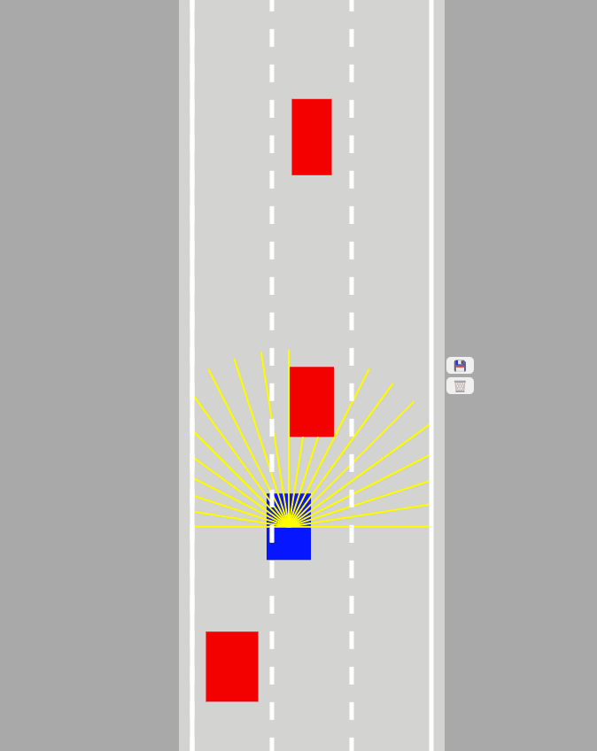

# Self Driving Car in 2D with DQN

## Gameplay
Some footage of the self driving car agent.

## Training
The agent was trained by sampling from an experience replay buffer which it populated by running simulations.
In particular, to fill the replay buffer with a variety of experiences, exploration was linearly decreasing from $\epsilon=0.5 \to \epsilon=0.02$ was used,
with a batch size of $64$ and lr of $0.001$. 

### Agent Input and Actions
The agent had as an input a $\mathbb{R}^{21}$ vector of sensor inputs, where each input is a number linearly interpolated from $[0,1]$, where $1$ represented an object touching the car and $0$ representing
no object detected. The agent has $3$ actions: move up, right, or left.   

### Reward Function
There was a total upperbound reward of $1000$ points. Each timestep (action taken) had a small penalty of $-0.1$ points in 
order to encourage activity. To prevent reward sparsity, there was $10000$ checkpoints, where the agent was rewarded for passing a checkpoint
it hadn't passed before and each checkpoint had the same unit of reward, i.e $50%$ of checkpoints passed would lead to
twice as many points as $25%$ covered. Moreover, there was a lump reward of $100$ points for passing the goal of $10000$ distance
and $-100$ points for crashing into the walls or into another car.

### Modifications/Experiments
Some modifications included changing the number of sensors (from 5, 11, to 21), changing the length of the sensors (100, 150, 200, 300), changing the 
steering movement of the car (from steering the car in a certain angle versus moving a fixed distance right, left, or up versus continuously moving left, right, up) and 
the depth of the network approximating the Q function. 
Moreover, elements from *imitation learning* was used- in particular, human "expert" experience was recorded and stored as an array
which was added to the experience replay buffer. Both **replay buffer spiking** (adding the human experience into the buffer and then filling the rest 
with the agent's own experiences) and **pre-training** on the human experience to have the q-values update in accordance with human experience was tried.

Moreover, a greedy agent hardcoded with if/else rules was used as a baseline.

Code references:
- https://github.com/tensorflow/tfjs-examples/tree/master/snake-dqn
- https://github.com/gniziemazity/Self-driving-car
